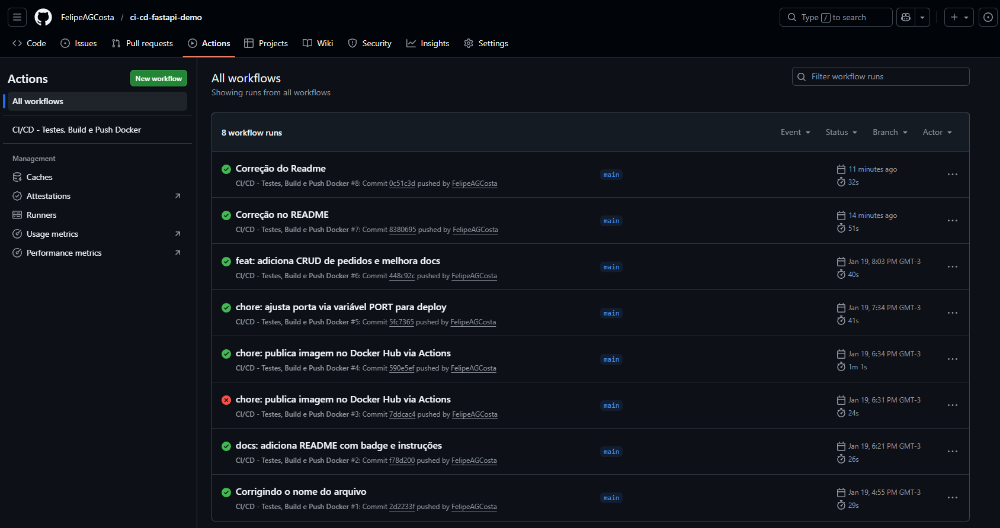
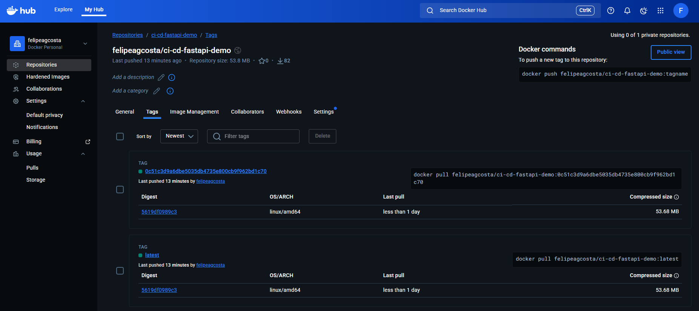
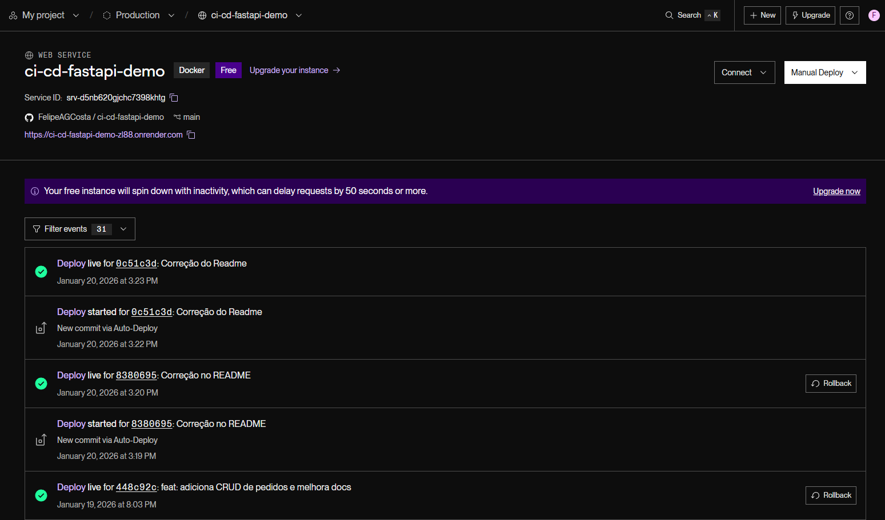
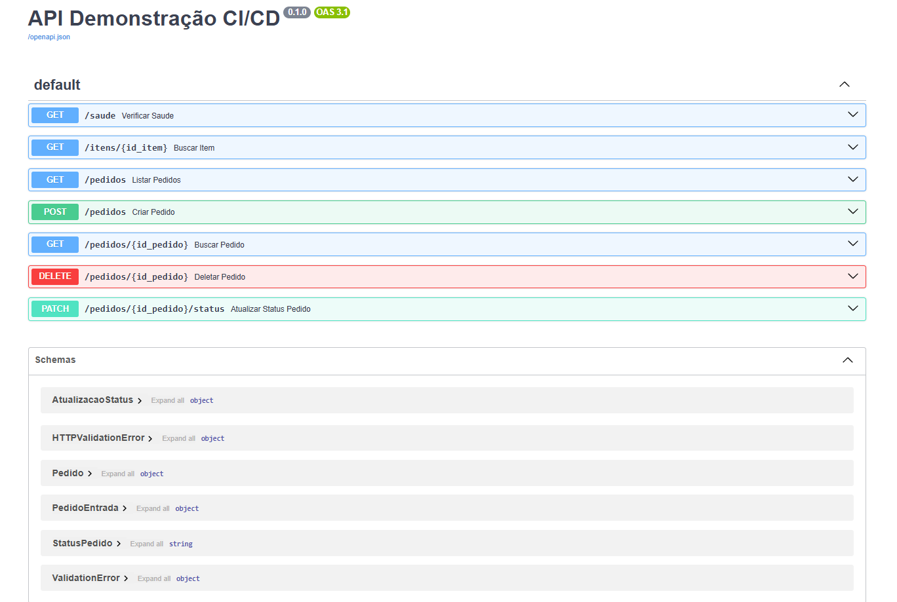

# API CI/CD com FastAPI, Docker e GitHub Actions

API REST em **Python (FastAPI)** com **testes automatizados (pytest)**, containerizada com **Docker** e validada automaticamente via **GitHub Actions** a cada push/PR na branch `main`.  
Além disso, a aplicação está publicada em produção (Render).

## 🔗 Links
- **Produção (raiz)**: https://ci-cd-fastapi-demo-zl88.onrender.com (redireciona para `/docs`)
- **Swagger (/docs)**: https://ci-cd-fastapi-demo-zl88.onrender.com/docs
- **Healthcheck (/saude)**: https://ci-cd-fastapi-demo-zl88.onrender.com/saude
- **Docker Hub**: `felipeagcosta/ci-cd-fastapi-demo`

## ✅ O que este projeto demonstra
- Criação de API REST com FastAPI
- Testes automatizados com `pytest`
- Containerização com Docker (Dockerfile)
- CI no GitHub Actions (testes + build da imagem)
- Publicação de imagem no Docker Hub (tag `latest` + tag por commit)
- Deploy em produção no Render (build via Dockerfile)

## 📸 Evidências (CI/CD e Deploy)

### ✅ GitHub Actions (pipeline verde)


### 🐳 Docker Hub (tags `latest` + SHA do commit)


### 🌐 Render (serviço em produção / Live)


### 📚 Swagger (endpoints disponíveis)


## 🚀 Endpoints principais
- `GET /` → redireciona para `/docs`
- `GET /saude` → verifica se a API está respondendo
- `GET /docs` → documentação Swagger
- `POST /pedidos` → cria pedido
- `GET /pedidos` → lista pedidos
- `GET /pedidos/{id_pedido}` → busca pedido
- `PATCH /pedidos/{id_pedido}/status` → atualiza status do pedido
- `DELETE /pedidos/{id_pedido}` → deleta pedido

## ▶️ Rodar local (sem Docker)
> Recomendado para desenvolvimento.

```bash
pip install -r requirements.txt
pytest
uvicorn app.main:aplicacao --reload --port 8003
```
Acesse:
- http://127.0.0.1:8003/saude

- http://127.0.0.1:8003/docs

## 🐳 Rodar com Docker (build local)
```bash
docker build -t ci-cd-fastapi-demo:dev .
docker run --rm -p 8003:8000 ci-cd-fastapi-demo:dev
```
Acesse: 
- http://localhost:8003/saude
- http://localhost:8003/docs

Por que -p 8003:8000?
Pois dentro do container a API roda na porta 8000 (padrão).
No seu PC você acessa pela 8003.
Isso “mapeia” 8003 (host) → 8000 (container).

Se a porta 8003 estiver ocupada:
```bash
docker run --rm -p 8004:8000 ci-cd-fastapi-demo:dev
```

## 📦 Rodar a imagem do Docker Hub (sem build)
```bash 
docker pull felipeagcosta/ci-cd-fastapi-demo:latest
docker run --rm -p 8003:8000 felipeagcosta/ci-cd-fastapi-demo:latest
```

## ⚙️ CI/CD (GitHub Actions)
A cada push/PR na main, o workflow executa:

1. Instala dependências

2. Roda testes (pytest)

3. Build da imagem Docker

4. Push no Docker Hub (tags):

- latest

- `<sha-do-commit>`

## 💼 Por que isso importa em ambiente real?
- Qualidade: testes automáticos evitam regressões e falhas em produção

- Reprodutibilidade: Docker padroniza o ambiente (sem “na minha máquina funciona”)

- Entrega contínua: cada mudança vira um artefato versionado (imagem Docker)

- Rastreabilidade: tags por commit permitem identificar exatamente o que foi publicado